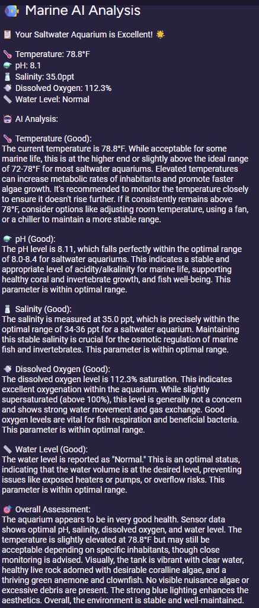
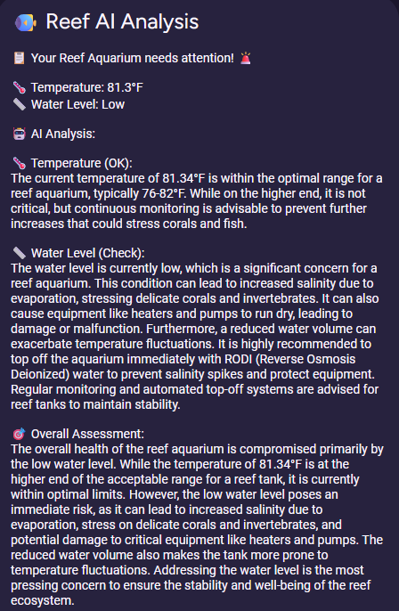
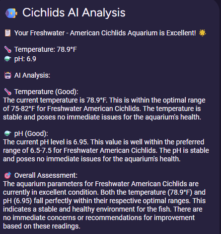
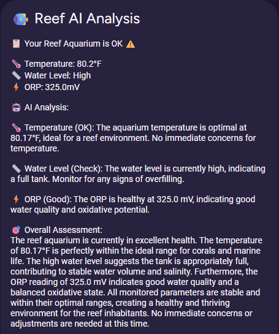
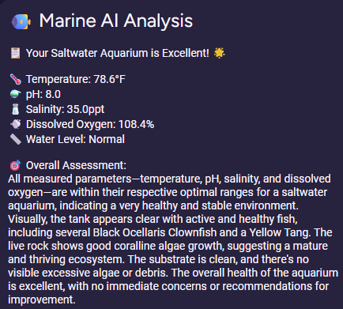

[](https://github.com/hacs/integration)
[](https://github.com/TheRealFalseReality/Aquarium-AI-Homeassistant/wiki)
[](https://github.com/TheRealFalseReality/Aquarium-AI-Homeassistant/actions/workflows/hassfest.yaml)
[](https://github.com/TheRealFalseReality/Aquarium-AI-Homeassistant/actions/workflows/validate.yml)  

[](https://github.com/TheRealFalseReality/Aquarium-AI-Homeassistant/releases)


# Aquarium AI for Home Assistant


**Aquarium AI** is a custom integration for [Home Assistant](https://www.home-assistant.io/) that uses the power of AI to analyze the conditions of your aquarium. It dynamically evaluates your existing sensors and camera feeds, providing clear text-based analyses of both quantitative sensor data and qualitative visual observations.

This integration takes the guesswork out of maintaining a healthy aquatic environment by turning raw sensor data and visual monitoring into actionable insights.

> [!WARNING]
> **AI Disclaimer**: While this integration leverages advanced AI technology to analyze your aquarium conditions, please remember that AI can sometimes get things wrong. The AI-generated analyses and recommendations should be used as helpful guidance, but should not replace your own expertise, professional advice, or careful observation of your aquarium. Always verify AI suggestions against your knowledge of aquarium care and consult with aquarium professionals when making important decisions about your aquatic environment.

---

## Features

* **AI-Powered Analysis**: Leverages the built-in `ai_task` service to generate natural language analyses of your aquarium's conditions.
* **Dynamic Entity Creation**: Automatically creates text sensors for each AI analysis point (e.g., temperature, pH, overall health) based on the sensors you provide.
* **Water Change Recommendations**: AI evaluates when water changes are needed based on parameters, bioload, filtration, and maintenance schedule.
* **Context-Aware Analysis**: Optionally provide tank volume, filtration details, inhabitants, and maintenance history for more accurate recommendations.
* **Camera Visual Analysis**: Optional camera integration for AI-powered visual monitoring of water clarity, fish health, plant condition, and maintenance needs.
* **Binary Sensors**: Simple on/off indicators for water change needs and other critical conditions.
* **UI Configuration**: Simple setup process through the Home Assistant UI. No YAML configuration is required.
* **Customizable Polling**: Choose how often the AI analysis should run, from every hour to once a day.
* **On-Demand Updates**: Trigger an analysis at any time using a service call, perfect for automations and custom schedules.
* **Multiple Notification Formats**: Choose between detailed, condensed, or minimal notification styles.

---

## Prerequisites

> [!IMPORTANT]
> *Important Notice Regarding Home Assistant AI Tasks feature*:  
> **You must have a generative LLM AI installed in you Home Assistant via integrations (see link below), this typially creates an `ai_task.YOUR_PROVIDER` for this integration to use.**
>
Before you can install and use Aquarium AI, you must have the following set up:  

1. A working **Home Assistant** instance (Version 2025.1.0+).
2. **HACS (Home Assistant Community Store)** installed.  
3. The core **`ai_task`** integration must be enabled and configured in Home Assistant. This integration will not work without it. [**AI Task Documentation**](https://www.home-assistant.io/integrations/ai_task)
4. One or more **aquarium-related sensors** (e.g., temperature, pH, salinity, etc.) available in Home Assistant.
5. Optionally, one or more **camera entities** for visual monitoring of your aquarium.

---

## Installation

### Method 1: HACS (Recommended)
[](https://my.home-assistant.io/redirect/hacs_repository/?owner=TheRealFalseReality&repository=Aquarium-AI-Homeassistant&category=Integration)

1. Navigate to the **HACS** section in your Home Assistant.
2. Click on **Integrations**, then click the three-dots menu in the top-right and select **"Custom repositories"**.
3. Add the URL to this GitHub repository in the "Repository" field.
4. Select **"Integration"** for the category and click **"Add"**.
5. The "Aquarium AI" integration will now appear in your HACS list. Click on it and then click **"Download"**.
6. Restart Home Assistant when prompted.

### Method 2: Manual Installation

1. Download the latest release from the [Releases page](https://github.com/TheRealFalseReality/Aquarium-AI-Homeassistant/releases).
2. Unzip the downloaded file.
3. Copy the `aquarium_ai` folder (from within the `custom_components` directory) into your Home Assistant's `config/custom_components/` directory.
4. Restart Home Assistant.

---

## Configuration

Once installed, the integration must be configured through the UI.

1. Navigate to **Settings** -> **Devices & Services**.
2. Click the **"+ Add Integration"** button in the bottom right.
3. Search for **"Aquarium AI"** and click on it.
4. A configuration dialog will appear. You will be asked to provide:
   * **Aquarium Name**: A custom name for your tank (e.g., "Main Tank", "Reef Setup").
   * **Aquarium Type**: Select the type of your aquarium (e.g., Marine, Freshwater, Reef).
   * **AI Task**: Choose the AI task entity to use for analysis (e.g., ai_task.google_ai_task).
   * **Update Frequency**: Choose how often you want the analysis to run automatically.
   * **Auto-send Notifications**: Enable or disable automatic notifications.
   * **Notification Format**: Choose between detailed, condensed, or minimal notification styles.
   * **Sensors**: Select the sensor entities you wish for the AI to analyze (temperature, pH, salinity, dissolved oxygen, water level, ORP).
   * **Camera** (Optional): Select a camera entity for visual analysis of water quality, fish health, and maintenance needs.
   
   **Enhanced Tank Context (Optional - Recommended for Better AI Analysis):**
   * **Tank Volume**: Enter your aquarium's total water volume (e.g., "100 liters", "50 gallons").
   * **Filtration System**: Describe your filter setup including type, flow rate, and media (e.g., "Canister filter 1200 L/h with bio-media").
   * **Water Change Frequency**: Specify your maintenance schedule (e.g., "25% weekly", "20% every 2 weeks").
   * **Tank Inhabitants**: List your fish, invertebrates, and plants with quantities (e.g., "10 Neon Tetras, 5 Corydoras, 20 Cherry Shrimp").
   * **Last Water Change Date**: Select an input_datetime helper or sensor tracking your last water change (see setup instructions below).
   * **Additional Information**: Add any other context (e.g., "Recently added new fish", "Using CO2 injection").
   
5. Click **"Submit"**. The integration will set up all the necessary entities.

### Setting Up Last Water Change Tracking

To enable the AI to consider time since your last water change, you need to create a helper:

1. Navigate to **Settings** -> **Devices & Services** -> **Helpers**.
2. Click **"+ Create Helper"** and select **"Date and/or time"**.
3. Configure the helper:
   * **Name**: "Last Water Change" (or your preferred name)
   * **Icon**: `mdi:water-sync`
   * **Has date**: ✓ (checked)
   * **Has time**: ✓ (optional but recommended)
4. Click **"Create"**.
5. Update this helper's value whenever you perform a water change (manually or via automation).
6. In the Aquarium AI configuration, select this helper as the "Last Water Change Date" sensor.

**Pro Tip:** Create an automation to remind you to update this helper after each water change, or use a dashboard button to quickly update it.

---

## Usage & Entities

After configuration, the integration will create a new "Aquarium AI" device with several entities associated with it.


### AI Analysis Sensors

These `sensor` entities contain AI-generated text analysis limited to 1-2 sentences (under 255 characters):

* `sensor.[tank_name]_[sensor_name]_analysis`: AI analysis of each specific parameter (e.g., Temperature Analysis, pH Analysis).
* `sensor.[tank_name]_overall_analysis`: Comprehensive AI summary of the aquarium's overall health.
* `sensor.[tank_name]_water_change_recommendation`: AI-powered water change recommendation with brief reasoning.

### Status Sensors

These `sensor` entities provide quick status information:

* `sensor.[tank_name]_simple_status`: Overall status message with emoji (e.g., "Your Marine Aquarium is Excellent! 🌟").
* `sensor.[tank_name]_quick_status`: One or two-word status (e.g., "Excellent", "Good", "Needs Attention").
* `sensor.[tank_name]_[sensor_name]_status`: Status for each parameter with current value (e.g., "Good (24.5°C)").

### Binary Sensors

These `binary_sensor` entities provide simple on/off states:

* `binary_sensor.[tank_name]_water_change_needed`: Indicates whether a water change is currently recommended (On = Yes, Off = No).


Example Card:
```
type: markdown
content: >-
  ## **Marine tank is ***{{ states('sensor.marine_quick_status') }}*****


  {{ states('sensor.marine_overall_analysis') }}


  **Temperature is ***{{ states('sensor.marine_temperature_status') }}*****

  {{ states('sensor.marine_temperature_analysis') }}


  **pH is ***{{ states('sensor.marine_ph_status') }}*****

  {{ states('sensor.marine_ph_analysis') }}


  **Salinity is ***{{ states('sensor.marine_salinity_status') }}*****

  {{ states('sensor.marine_salinity_analysis') }}


  **Dissolved Oxygen is ***{{ states('sensor.marine_dissolved_oxygen_status')
  }}*****

  {{ states('sensor.marine_dissolved_oxygen_analysis') }}

```

### Notification System

The integration also sends periodic notifications (if enabled) with detailed analysis including:

* Overall status summary
* Current sensor readings with icons
* Detailed AI analysis for each parameter
* Visual observations from camera (if configured)
* **Water change recommendations** based on parameters, bioload, and maintenance schedule
* Recommendations when needed

#### Example Notifications

<table>
  <tr>
    <th>Marine Aquarium</th>
    <th>Reef Aquarium</th>
    <th>Cichlids Aquarium</th>
  </tr>
  <tr>
    <td></td>
    <td></td>
    <td></td>
  </tr>
</table>

**Notification Types:**

<table>
  <tr>
    <th>Condensed</th>
    <th>Minimal</th>
  </tr>
  <tr>
    <td></td>
    <td></td>
  </tr>
</table>

---

## Camera Visual Analysis

When a camera is configured, the AI will analyze images from your aquarium camera to provide additional insights:

### Visual Monitoring Capabilities

* **Water Quality Assessment**: Analyzes water clarity, color, and cloudiness without numerical measurements
* **Fish Health & Behavior**: Identifies fish species, counts visible fish, and observes behavioral patterns
* **Plant Health**: Monitors aquatic plant condition and growth patterns
* **Equipment Monitoring**: Checks visibility and apparent condition of equipment
* **Maintenance Alerts**: Identifies visible algae, debris, or cleanliness issues

### Integration with Sensor Data

Visual analysis complements sensor readings by providing context that numbers alone cannot capture. The AI combines both quantitative sensor data and qualitative visual observations to give you a complete picture of your aquarium's health.

**Note**: Camera analysis focuses on observable qualities rather than precise measurements, providing insights that enhance rather than replace your sensor monitoring.

---

## Advanced Usage: Service Calls

The integration adds services that allow you to trigger analysis updates manually. This is useful for creating automations based on specific events (e.g., after a water change).

### Service: `aquarium_ai.run_analysis`

Triggers analysis for **all configured aquariums**.

This service will:

* Update all AI analysis sensors with fresh analysis
* Update all status sensors with current readings  
* Send a notification (if notifications are enabled)

### Service: `aquarium_ai.run_analysis_for_aquarium`

Triggers analysis for **a specific aquarium**.

**Parameters:**
* `config_entry` (required): The config entry ID of the aquarium to analyze. You can select this from the UI using the aquarium selector.
* `send_notification` (optional, default: true): Whether to send a notification with the analysis results.

This service will:

* Update all AI analysis sensors with fresh analysis for the selected aquarium
* Update all status sensors with current readings for the selected aquarium
* Send a notification (if notifications are enabled and send_notification is true) for the selected aquarium

**Use Cases:**
* Run on-demand analysis on a specific tank without affecting other aquariums
* Trigger analysis after water changes or maintenance
* Send instant notifications to your mobile device about your tank's status
* Create automations based on parameter status changes (Good, OK, Check, Adjust, Low, High)
* Integrate with other Home Assistant features like lights, switches, and scripts

### Example Automations

#### Schedule Daily Analysis for All Aquariums

This automation runs an analysis every day at 8:00 AM for all configured aquariums, overriding the schedule you chose in the config.

```yaml
automation:
  - alias: "Run Aquarium AI Analysis Daily at 8 AM"
    trigger:
      - platform: time
        at: "08:00:00"
    action:
      - service: aquarium_ai.run_analysis
```

#### Schedule Analysis for a Specific Aquarium

This automation runs an analysis for a specific aquarium every day at 9:00 AM.

```yaml
automation:
  - alias: "Run Marine Tank Analysis Daily at 9 AM"
    trigger:
      - platform: time
        at: "09:00:00"
    action:
      - service: aquarium_ai.run_analysis_for_aquarium
        data:
          config_entry: "your_config_entry_id_here"
```

**Tip:** To find your config entry ID, go to **Settings** -> **Devices & Services**, click on your Aquarium AI integration, and the ID will be in the URL.

#### Water Change Reminder

Get notified when the AI recommends a water change:

```yaml
automation:
  - alias: "Notify When Water Change Needed"
    trigger:
      - platform: state
        entity_id: binary_sensor.my_aquarium_water_change_needed
        to: "on"
    action:
      - service: notify.mobile_app
        data:
          title: "🐠 Aquarium Maintenance"
          message: >
            Water change recommended for {{ state_attr('binary_sensor.my_aquarium_water_change_needed', 'recommendation') }}
```

#### Update Last Water Change After Maintenance

Automatically update your water change tracker when you perform maintenance:

```yaml
automation:
  - alias: "Update Last Water Change"
    trigger:
      - platform: event
        event_type: call_service
        event_data:
          domain: input_boolean
          service: turn_on
          service_data:
            entity_id: input_boolean.water_change_completed
    action:
      - service: input_datetime.set_datetime
        target:
          entity_id: input_datetime.last_water_change
        data:
          datetime: "{{ now().strftime('%Y-%m-%d %H:%M:%S') }}"
      - service: input_boolean.turn_off
        target:
          entity_id: input_boolean.water_change_completed
```

#### Send Mobile Notification After Analysis

Send a detailed notification to your phone after running analysis on a specific aquarium:

```yaml
automation:
  - alias: "Aquarium Analysis to Phone"
    trigger:
      - platform: time
        at: "20:00:00"
    action:
      - service: aquarium_ai.run_analysis_for_aquarium
        data:
          config_entry: "your_config_entry_id_here"
          send_notification: true
      - service: notify.mobile_app_your_phone
        data:
          title: "🐠 {{ states('sensor.marine_tank_name') }} Update"
          message: >
            Status: {{ states('sensor.marine_quick_status') }}
            
            {{ states('sensor.marine_overall_analysis') }}
            
            Temperature: {{ states('sensor.marine_temperature_status') }}
            pH: {{ states('sensor.marine_ph_status') }}
            
            {{ states('sensor.marine_water_change_recommendation') }}
```

#### Trigger Automation When Parameter Status Changes

Run automations when any parameter status changes to "Check", "Adjust", "Low", or "High":

```yaml
automation:
  - alias: "Alert on Temperature Issues"
    trigger:
      - platform: state
        entity_id: sensor.marine_temperature_status
        to: "Check"
    action:
      - service: notify.mobile_app_your_phone
        data:
          title: "⚠️ Aquarium Temperature Alert"
          message: >
            Temperature status is now {{ states('sensor.marine_temperature_status') }}!
            Current reading: {{ state_attr('sensor.marine_temperature', 'state') }}
            Analysis: {{ states('sensor.marine_temperature_analysis') }}
          data:
            priority: high
            tag: "aquarium_temp_alert"
      - service: persistent_notification.create
        data:
          title: "Temperature Check Required"
          message: "{{ states('sensor.marine_temperature_analysis') }}"
```

#### pH Level Monitoring with Multiple Actions

Trigger multiple actions when pH needs adjustment:

```yaml
automation:
  - alias: "pH Adjustment Needed"
    trigger:
      - platform: state
        entity_id: sensor.marine_ph_status
        to: "Adjust"
    action:
      # Send mobile notification
      - service: notify.mobile_app_your_phone
        data:
          title: "🧪 pH Adjustment Required"
          message: "{{ states('sensor.marine_ph_analysis') }}"
          data:
            priority: high
      # Flash aquarium light red as visual indicator
      - service: light.turn_on
        target:
          entity_id: light.aquarium_light
        data:
          rgb_color: [255, 0, 0]
          brightness: 255
      - delay:
          seconds: 2
      - service: light.turn_off
        target:
          entity_id: light.aquarium_light
      - delay:
          seconds: 1
      - service: light.turn_on
        target:
          entity_id: light.aquarium_light
```

#### Low Oxygen Alert with Equipment Control

Increase aeration when dissolved oxygen is low:

```yaml
automation:
  - alias: "Low Oxygen - Increase Aeration"
    trigger:
      - platform: state
        entity_id: sensor.marine_dissolved_oxygen_status
        to: "Low"
    action:
      # Send notification
      - service: notify.mobile_app_your_phone
        data:
          title: "💨 Low Oxygen Alert"
          message: >
            Dissolved oxygen is low!
            {{ states('sensor.marine_dissolved_oxygen_analysis') }}
            Auto-increasing air pump speed.
      # Turn on additional air pump or increase speed
      - service: switch.turn_on
        target:
          entity_id: switch.aquarium_air_pump_boost
      # Run fresh analysis after 30 minutes
      - delay:
          minutes: 30
      - service: aquarium_ai.run_analysis_for_aquarium
        data:
          config_entry: "your_config_entry_id_here"
```

#### Dashboard Notification for Overall Status Change

Create a dashboard notification when overall tank status changes:

```yaml
automation:
  - alias: "Tank Status Change Notification"
    trigger:
      - platform: state
        entity_id: sensor.marine_quick_status
    condition:
      - condition: template
        value_template: >
          {{ trigger.from_state.state != trigger.to_state.state and 
             trigger.from_state.state not in ['unknown', 'unavailable'] }}
    action:
      - service: notify.persistent_notification
        data:
          title: "🌊 Aquarium Status Changed"
          message: >
            Status changed from {{ trigger.from_state.state }} to {{ trigger.to_state.state }}
            
            {{ states('sensor.marine_overall_analysis') }}
```

#### Scheduled Analysis with Conditional Notifications

Run analysis daily but only send notifications if action is needed:

```yaml
automation:
  - alias: "Daily Aquarium Check - Smart Notifications"
    trigger:
      - platform: time
        at: "08:00:00"
    action:
      # Run analysis without automatic notification
      - service: aquarium_ai.run_analysis_for_aquarium
        data:
          config_entry: "your_config_entry_id_here"
          send_notification: false
      # Wait for analysis to complete
      - delay:
          seconds: 10
      # Only send notification if water change is needed or status isn't "Good"
      - choose:
          - conditions:
              - condition: or
                conditions:
                  - condition: state
                    entity_id: binary_sensor.marine_water_change_needed
                    state: "on"
                  - condition: template
                    value_template: >
                      {{ states('sensor.marine_quick_status') not in ['Excellent', 'Good'] }}
            sequence:
              - service: notify.mobile_app_your_phone
                data:
                  title: "⚠️ Aquarium Needs Attention"
                  message: >
                    Quick Status: {{ states('sensor.marine_quick_status') }}
                    {{ states('sensor.marine_overall_analysis') }}
                    
                    Water Change: {{ states('sensor.marine_water_change_recommendation') }}
```

#### Multi-Tank Monitoring

Monitor multiple aquariums and send a consolidated report:

```yaml
automation:
  - alias: "Multi-Tank Daily Report"
    trigger:
      - platform: time
        at: "19:00:00"
    action:
      # Analyze all tanks
      - service: aquarium_ai.run_analysis
        data:
          send_notification: false
      - delay:
          seconds: 15
      # Send consolidated notification
      - service: notify.mobile_app_your_phone
        data:
          title: "🐠 Daily Aquarium Report"
          message: >
            **Marine Tank:** {{ states('sensor.marine_quick_status') }}
            {{ states('sensor.marine_overall_analysis') }}
            
            **Freshwater Tank:** {{ states('sensor.freshwater_quick_status') }}
            {{ states('sensor.freshwater_overall_analysis') }}
            
            **Reef Tank:** {{ states('sensor.reef_quick_status') }}
            {{ states('sensor.reef_overall_analysis') }}
```

#### Trigger Analysis After Water Change

Automatically run analysis after completing a water change to verify parameters:

```yaml
automation:
  - alias: "Analyze After Water Change"
    trigger:
      - platform: state
        entity_id: input_boolean.water_change_done
        to: "on"
    action:
      - service: input_datetime.set_datetime
        target:
          entity_id: input_datetime.last_water_change
        data:
          datetime: "{{ now().strftime('%Y-%m-%d %H:%M:%S') }}"
      - delay:
          minutes: 15  # Wait for parameters to stabilize
      - service: aquarium_ai.run_analysis_for_aquarium
        data:
          config_entry: "your_config_entry_id_here"
          send_notification: true
      - service: input_boolean.turn_off
        target:
          entity_id: input_boolean.water_change_done
      - service: notify.mobile_app_your_phone
        data:
          title: "✅ Water Change Complete"
          message: >
            Analysis after water change:
            {{ states('sensor.marine_overall_analysis') }}
```

#### Critical Alert with Voice Announcement

Use Google Home or Alexa to announce critical aquarium issues:

```yaml
automation:
  - alias: "Critical Aquarium Alert"
    trigger:
      - platform: template
        value_template: >
          {{ states('sensor.marine_quick_status') in ['Critical', 'Problem', 'Needs Attention'] }}
    action:
      - service: notify.mobile_app_your_phone
        data:
          title: "🚨 CRITICAL: Aquarium Issue"
          message: "{{ states('sensor.marine_overall_analysis') }}"
          data:
            priority: high
            ttl: 0
            channel: alarm_stream
      - service: tts.google_translate_say
        target:
          entity_id: media_player.living_room_speaker
        data:
          message: >
            Attention! Critical aquarium alert. 
            {{ states('sensor.marine_overall_analysis') }}
```

### Creative Automation Ideas

The `run_analysis_for_aquarium` service opens up many possibilities for Home Assistant automation. Here are some creative ideas:

#### 📱 **Notification Scenarios**
* Send morning briefings to your phone before work
* Alert family members when maintenance is needed
* Send photos from your aquarium camera along with analysis
* Create priority alerts for critical parameter changes
* Weekly summary reports via email or messaging apps

#### 🎨 **Visual Indicators**
* Change smart bulb colors based on tank status (green=good, yellow=check, red=problem)
* Flash aquarium lights when parameters need attention
* Display status on LED matrices or smart displays
* Use presence detection to show status when you walk by

#### 🔧 **Equipment Automation**
* Auto-adjust heater when temperature is off
* Increase/decrease air pump based on oxygen levels
* Control protein skimmers based on water quality
* Trigger automatic feeders based on fish health observations
* Manage dosing pumps for calcium/alkalinity

#### 📊 **Data & Monitoring**
* Log analysis results to InfluxDB or Google Sheets
* Create graphs showing parameter trends over time
* Compare multiple tanks side-by-side
* Track correlations between maintenance and water quality

#### 🏡 **Smart Home Integration**
* Pause aquarium analysis during vacation mode
* Include tank status in good morning/night routines
* Voice control: "Hey Google, how's my aquarium?"
* Dashboard widgets for at-a-glance monitoring

#### ⏰ **Time-Based Actions**
* Run analysis after feeding times
* Check parameters before and after water changes
* Weekend deep-dive analysis vs. weekday quick checks
* Seasonal adjustments (more frequent in summer heat)

#### 🎯 **Conditional Logic**
* Only notify if status worsens (not improves)
* Different notification recipients based on severity
* Escalate alerts if issues persist over time
* Smart reminders based on last maintenance date

### Parameter Status Reference

Understanding the status values returned by the integration helps you create better automations:

| Status | Meaning | Suggested Action | Automation Use |
|--------|---------|-----------------|----------------|
| **Good** | Parameter is in optimal range | No action needed | Green indicator, positive notifications |
| **OK** | Parameter is acceptable but not ideal | Monitor, no immediate action | Yellow indicator, info notifications |
| **Check** | Parameter needs attention | Review and consider adjustment | Orange indicator, alert notifications |
| **Adjust** | Parameter needs correction (pH specific) | Take corrective action | Red indicator, high priority alerts |
| **Low** | Parameter is below acceptable range | Increase parameter value | Alert + equipment automation |
| **High** | Parameter is above acceptable range | Decrease parameter value | Alert + equipment automation |

**Example Status Sensors:**
* `sensor.marine_temperature_status` → "Good", "OK", "Check"
* `sensor.marine_ph_status` → "Good", "OK", "Adjust"
* `sensor.marine_dissolved_oxygen_status` → "Good", "OK", "Low", "High"
* `sensor.marine_quick_status` → "Excellent", "Good", "Needs Attention", "Critical"

**Tip:** Use these status values in your automation conditions and triggers to create smart, responsive aquarium management systems.


---

## Water Change Recommendations

The integration now includes intelligent water change recommendations based on:

* **Current Water Parameters**: Evaluates if parameters are trending towards unsafe levels
* **Tank Volume**: Calculates appropriate water change percentages
* **Bioload**: Considers fish/invertebrate population and waste production
* **Filtration Capacity**: Assesses if your filter can handle the current bioload
* **Water Change Schedule**: Factors in your maintenance frequency
* **Time Since Last Change**: Uses the elapsed time when the helper is configured

### How It Works

The AI analyzes all available information and provides:

1. **Binary Sensor** (`binary_sensor.[tank_name]_water_change_needed`): Simple on/off indicator
2. **Text Sensor** (`sensor.[tank_name]_water_change_recommendation`): Detailed recommendation with reasoning
3. **Notification Section**: Included in all notifications with specific guidance

**Example Recommendations:**
* "Yes - High nitrate levels suggest 40% change recommended within 2-3 days"
* "No - Parameters stable with current 25% weekly maintenance schedule"
* "Yes - It's been 10 days since last change, time for routine 30% water change"

Example Card, conditional:
```
type: markdown
content: "{{states('sensor.marine_water_change_recommendation')}}"
title: Water Change
visibility:
  - condition: state
    entity: binary_sensor.marine_water_change_needed
    state: "on"
```

---

### A Note on Development (Vibe Coding Disclaimer)

This integration is a passion project developed with a "just build it" philosophy. It's built iteratively as ideas and inspiration strike. While every effort is made to ensure it's stable and reliable, you might encounter unexpected quirks. Community feedback is a huge part of this process, so please don't hesitate to open an issue if you find a bug or have a great idea!

---

## Translations

Aquarium AI supports multiple languages to make it accessible to users worldwide! 

### Available Languages

- 🇬🇧 **English (en)** - Default
- 🇩🇪 **German (de)** - Deutsch

### Help Translate

We welcome community translations! If you'd like to translate Aquarium AI into your language:

1. Check the [Translation Guide](TRANSLATION_GUIDE.md) for detailed instructions
2. Copy the `custom_components/aquarium_ai/translations/template.json` file
3. Translate the strings to your language
4. Submit a Pull Request

Your translation will help make aquarium monitoring accessible to more users around the world! 🌍🐠

---

## Contributing

Contributions are welcome! Whether you want to translate the integration, report a bug, suggest a feature, or contribute code, we'd love your help!

See [CONTRIBUTING.md](CONTRIBUTING.md) for detailed guidelines.

### Quick Links

- **🌍 Translations**: Help translate the integration into other languages → [Translation Guide](TRANSLATION_GUIDE.md)
- **🐛 Bug Reports**: Report issues → [Open an Issue](https://github.com/TheRealFalseReality/Aquarium-AI-Homeassistant/issues)
- **💡 Feature Requests**: Suggest new features → [Open an Issue](https://github.com/TheRealFalseReality/Aquarium-AI-Homeassistant/issues)
- **💻 Code Contributions**: Submit pull requests → [Contributing Guide](CONTRIBUTING.md)

## [AquaPi for ESPHome](https://github.com/TheRealFalseReality/aquapi)


The Aquarium meets the Smart Home! Add more sensors to Home Assistant! 

**[Setup Guide](https://github.com/TheRealFalseReality/aquapi/wiki/Setup-AquaPi)**  
**[Build It Yourself](https://github.com/TheRealFalseReality/aquapi/wiki/Build-It-Yourself)**  
**[Wiki](https://github.com/TheRealFalseReality/aquapi/wiki)**  

**[Join the conversation on Reef2Reef!](https://www.reef2reef.com/threads/aquapi-an-open-souce-aquarium-controller.1033171/)**  

### **[Buy Now!](https://www.capitalcityaquatics.com/store/aquapi)**

## [Aquarium AI App](https://play.google.com/store/apps/details?id=com.cca.fishai)
Your Intelligent Aquatic Assistant

Take the guesswork out of aquarium keeping with Aquarium AI! Our powerful, AI-driven tools help both new and seasoned aquarists create a thriving underwater ecosystem.

Unlock the Power of AI with Your Own API Key!

Aquarium AI is different from other AI-enabled aquarium apps. We empower you by allowing you to use your own AI API keys from Gemini, OpenAI, and Groq. This unique "Bring Your Own Key" model gives you:

Higher AI API Call Limits: Enjoy significantly more interactions with our AI, including the powerful Gemini 2.5 flash.

Unlimited Features: Get unrestricted access to all our features, including the ability to add and manage an unlimited number of tanks.

Key Features:

🤖 Intelligent AI Chatbot: Have a question about your tank? Get expert advice on water parameters, fish health, tank maintenance, and more, 24/7.

🧪 AI Fish Compatibility Tool: Instantly analyze the compatibility of different fish species with in-depth reports and personalized care guides.

🦐 AI Stocking Assistant: Plan your dream aquarium with confidence. Get custom stocking recommendations based on your tank size, experience level, and desired fish type.

🏠 My Tanks: Create and manage your custom tanks with inhabitants. Get personalized stocking recommendations for your tanks.

📸 Photo Analysis: Analyze photos of your fish and tank. Our AI can help identify species, detect potential health issues, and provide recommendations.

📐 Aquarium Calculators: Access essential tools for managing your aquarium's technical details, including a handy Tank Volume Calculator.

[](https://play.google.com/store/apps/details?id=com.cca.fishai)

[](https://github.com/TheRealFalseReality/Aquarium-AI-Homeassistant/actions/workflows/pytest.yaml)
