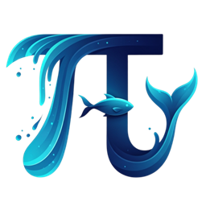

# Aquarium AI for Home Assistant



[](https://github.com/hacs/integration)

**Aquarium AI** is a custom integration for [Home Assistant](https://www.home-assistant.io/) that uses the power of AI to analyze the conditions of your aquarium. It dynamically evaluates your existing sensors, provides clear text-based analyses, and automatically tracks trends in your aquarium's key parameters.

This integration takes the guesswork out of maintaining a healthy aquatic environment by turning raw sensor data into actionable insights.

---

## Features

* **AI-Powered Analysis**: Leverages the built-in `ai_task` service to generate natural language analyses of your aquarium's conditions.
* **Dynamic Entity Creation**: Automatically creates text sensors for each AI analysis point (e.g., temperature, pH, overall health) based on the sensors you provide.
* **Built-in Trend Tracking**: Creates both a binary `trend` sensor and a user-friendly text sensor (e.g., "Rising", "Falling", "Stable") for each of your numeric sensors.
* **UI Configuration**: Simple setup process through the Home Assistant UI. No YAML configuration is required.
* **Customizable Polling**: Choose how often the AI analysis should run, from every hour to once a day.
* **On-Demand Updates**: Trigger an analysis at any time using a service call, perfect for automations and custom schedules.

---

## Prerequisites

> [!IMPORTANT]
> *Important Notice Regarding Home Assistant AI Tasks feature*:  
> **You must have a generative LLM AI installed in you Home Assistant via integrations (see link below), this typially creates an `ai_task.YOUR_PROVIDER` for this integration to use.**
> 
Before you can install and use Aquarium AI, you must have the following set up:  

1. A working **Home Assistant** instance (Version 2023.5+).
2. **HACS (Home Assistant Community Store)** installed.  
3. The core **`ai_task`** integration must be enabled and configured in Home Assistant. This integration will not work without it. [**AI Task Documentation**](https://www.home-assistant.io/integrations/ai_task)
4. One or more **aquarium-related sensors** (e.g., temperature, pH, salinity, etc.) available in Home Assistant.

---

## Installation

### Method 1: HACS (Recommended)

1. Navigate to the **HACS** section in your Home Assistant.
2. Click on **Integrations**, then click the three-dots menu in the top-right and select **"Custom repositories"**.
3. Add the URL to this GitHub repository in the "Repository" field.
4. Select **"Integration"** for the category and click **"Add"**.
5. The "Aquarium AI" integration will now appear in your HACS list. Click on it and then click **"Download"**.
6. Restart Home Assistant when prompted.

### Method 2: Manual Installation

1. Download the latest release from the [Releases page](https://github.com/YOUR_GITHUB_USERNAME/aquarium-ai/releases).
2. Unzip the downloaded file.
3. Copy the `aquarium_ai` folder (from within the `custom_components` directory) into your Home Assistant's `config/custom_components/` directory.
4. Restart Home Assistant.

---

## Configuration

Once installed, the integration must be configured through the UI.

1. Navigate to **Settings** -> **Devices & Services**.
2. Click the **"+ Add Integration"** button in the bottom right.
3. Search for **"Aquarium AI"** and click on it.
4. A configuration dialog will appear. You will be asked to provide:
    * **Aquarium Type**: Select the type of your aquarium (e.g., Marine, Freshwater).
    * **Sensors**: Select all the sensor entities you wish for the AI to analyze.
    * **Update Frequency**: Choose how often you want the analysis to run automatically.
5. Click **"Submit"**. The integration will set up all the necessary entities.

---

## Usage & Entities

After configuration, the integration will create a new "Aquarium AI" device with several entities associated with it.

### AI Analysis Sensors

These `sensor` entities contain AI-generated text analysis limited to 1-2 sentences (under 255 characters):

* `sensor.[tank_name]_[sensor_name]_analysis`: AI analysis of each specific parameter (e.g., Temperature Analysis, pH Analysis).
* `sensor.[tank_name]_overall_analysis`: Comprehensive AI summary of the aquarium's overall health.

### Status Sensors

These `sensor` entities provide quick status information:

* `sensor.[tank_name]_simple_status`: Overall status message with emoji (e.g., "Your Marine Aquarium is Excellent! 🌟").
* `sensor.[tank_name]_quick_status`: One or two-word status (e.g., "Excellent", "Good", "Needs Attention").
* `sensor.[tank_name]_[sensor_name]_status`: Status for each parameter with current value (e.g., "Good (24.5°C)").

### Notification System

The integration also sends periodic notifications (if enabled) with detailed analysis including:

* Overall status summary
* Current sensor readings with icons
* Detailed AI analysis for each parameter
* Recommendations when needed

---

## Advanced Usage: Service Call

The integration adds a service that allows you to trigger analysis updates manually. This is useful for creating automations based on specific events (e.g., after a water change).

**Service:** `aquarium_ai.run_analysis`

This service will:
- Update all AI analysis sensors with fresh analysis
- Update all status sensors with current readings  
- Send a notification (if notifications are enabled)

### Example Automation

This automation runs an analysis every day at 8:00 AM, overriding the schedule you chose in the config.

```yaml
automation:
  - alias: "Run Aquarium AI Analysis Daily at 8 AM"
    trigger:
      - platform: time
        at: "08:00:00"
    action:
      - service: aquarium_ai.run_analysis
```

---

### A Note on Development (Vibe Coding Disclaimer)

This integration is a passion project developed with a "just build it" philosophy. It's built iteratively as ideas and inspiration strike. While every effort is made to ensure it's stable and reliable, you might encounter unexpected quirks. Community feedback is a huge part of this process, so please don't hesitate to open an issue if you find a bug or have a great idea!

---

## Contributing

Contributions are welcome! If you have an idea for an improvement or have found a bug, please [open an issue](https://github.com/YOUR_GITHUB_USERNAME/aquarium-ai/issues) or submit a pull request.
